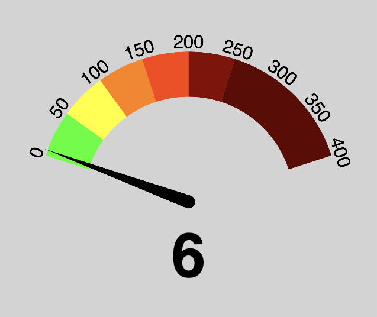
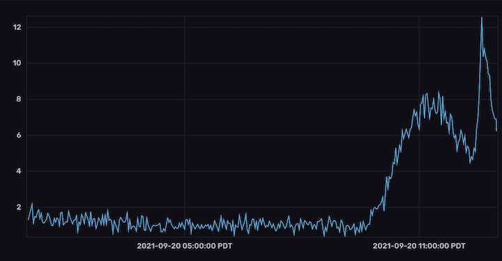

# AQI meter using PMS7003




## Design

 * Raspberry Pi reads data from sensor.
 * RPi runs telegraf to feed data into influxdb2.
 * RPi runs tiny webserver that displays basic metrics.

Note: It's a wee jank, but the telegraf output script also updates the webserver data. I guess TODO make it a daemon of its own and just have telegraf read from it or something.

## Parts

 * [Raspberry Pi Model 3 A+](https://www.adafruit.com/product/4027)
 * [SD/MicroSD Memory Card - 8 GB SDHC](https://www.adafruit.com/product/1294)
 * [5V 2.5A Switching Power Supply with 20AWG MicroUSB Cable](https://www.adafruit.com/product/1995)
 * [Adafruit Raspberry Pi A+ Case - Smoke Base w/ Clear Top](https://www.adafruit.com/product/2359)
 * PMS7003M + G7 Switch Board (I found one that had a bread breakout on it that was convenient) 
 
This post has the parts you'll need: https://joshefin.xyz/air-quality-with-raspberrypi-pms7003-and-java/ - also this is all heavily based on his work and instructions!

The adaptor I received had a "dupont" pinout and cabling already, so I didn't
need to do those steps. I just wired right to GPIO etc.

## Prework on SD card (in /boot)

### wifi

wpa_supplicant.conf:

```
country=us
update_config=1
ctrl_interface=/var/run/wpa_supplicant
network={
ssid="Your_SSID"
psk="Your_KEY"
}

```


### ssh

```
# this will be headless, so enable ssh
touch ssh
```

## Setup pi - ssh in as pi/raspberry:

```
# needed for telegraf
curl -sL https://repos.influxdata.com/influxdb.key | sudo apt-key add -
echo "deb https://repos.influxdata.com/debian stretch stable" | sudo tee /etc/apt/sources.list.d/influxdb.list
sudo apt-get update

# do the needful
sudo apt-get upgrade

# telegraf
sudo apt-get install telegraf

# our local web server!
sudo apt-get install nginx

# Used for sensor script
sudo pip3 install pms7003

# used for sanity
sudo timedatectl set-timezone America/Los_Angeles

# This is so it will get its hostname from DHCP
sudo hostnamectl set-hostname localhost

# edit the 127.0.1.1 mapping from raspberrypi to a better name so you can resolve MY_AQI.local
sudo vi /etc/hosts

# We're going to use the serial port for the sensor, so disable the serial
# console.
sudo raspi-config
# In Interfacing Options > Serial section, disable the serial login shell
# and enable the serial interface.

# needed so telegraf can read/write serial device
sudo usermod -a -G dialout telegraf

# For the web server, we constantly write to a json blob the latest value. Let's be kind to our SD card.
sudo mkdir /var/www/html/t
sudo echo "tmpfs  /var/www/html/t tmpfs size=10M,nr_inodes=1k,mode=755,uid=$(id -u telegraf) 0 0" >> /etc/fstab
sudo mount /var/www/html/t

cd
git clone https://github.com/c6rbon/AQI-PMS7003.git

# Install the onboard HTML gauge
cp AQI-PMS7003/html/* /var/www/html

# Edit telegraf.conf with your own influxdb2 credentials, or whatever output
# you like.

sudo cp telegraf.conf
sudo systemctl reload telegraf
```


